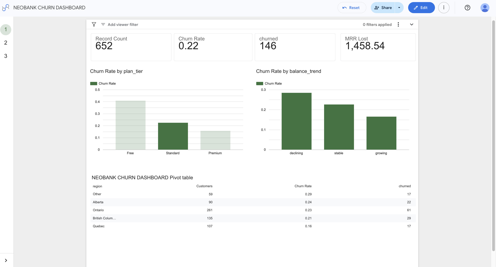
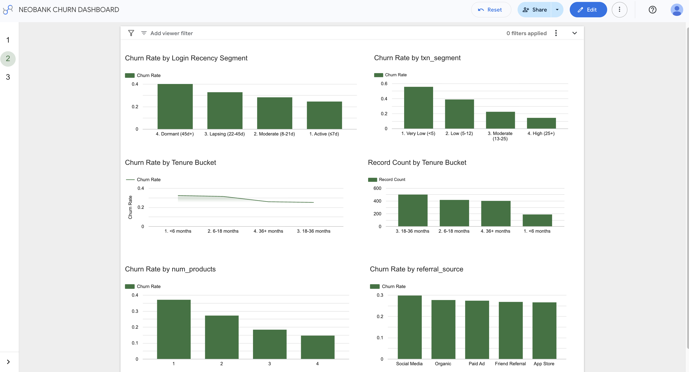
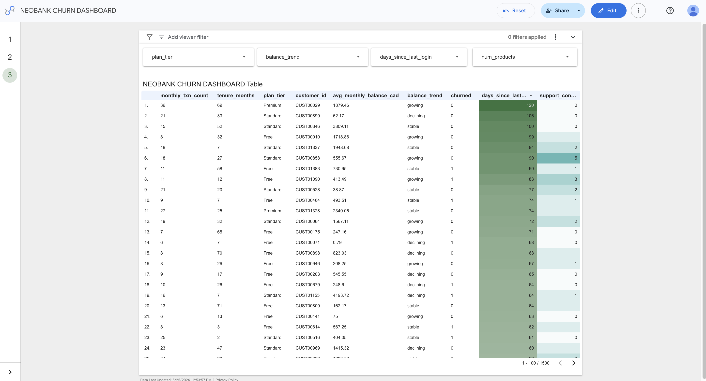

# Neobank Customer Churn Analysis

**Portfolio Project 2 | Tools: Python · Pandas · SQL · Looker Studio**

---

## Project Overview

Customer churn is one of the most costly problems a neobank faces — acquiring a new customer costs significantly more than retaining an existing one. This project analyses a synthetic dataset of **1,500 neobank customers** to identify who is churning, why, and which customers to prioritise for retention.

The analysis covers the full analytical workflow: data generation, exploratory analysis in Python/Pandas, SQL-based segmentation queries, and an interactive Looker Studio dashboard.

### Business Questions Answered

1. Which customer segments have the highest churn rates?
2. Which behavioural signals most strongly predict churn?
3. Which customers should be prioritised for a retention campaign?
4. What is the monthly revenue at stake?

---

## Key Findings

| Finding | Metric |
|---|---|
| Overall churn rate | **27.9%** |
| Free-tier churn rate | **40.8%** — 2.6× higher than Premium |
| Premium-tier churn rate | **15.6%** |
| Declining-balance customers churn rate | **35.6%** |
| Dormant users (45+ days since login) churn rate | **40.0%** |
| High-risk segment churn rate | **78.6%** |
| MRR lost to churn (paid plans) | **$2,378 CAD/month** |
| MRR recoverable with 5pp churn reduction | **~$982 CAD/month** |

### Top Churn Drivers (in order of impact)

1. **Plan tier** — Free customers have no switching cost and churn at 40.8%
2. **Transaction frequency** — customers making fewer than 5 transactions/month show the highest churn signal
3. **Login recency** — dormant users (45+ days inactive) churn at 40.0%
4. **Balance trend** — declining balances precede churn; a leading indicator for early intervention
5. **Tenure** — new customers (<6 months) churn at 33.6%; the onboarding window is critical

---

## Recommendations

**1. Onboarding redesign**
The highest-ROI intervention. Build a structured 30-day activation sequence targeting new customers: link external bank → open savings goal → make 5+ transactions. Early-tenure churn at 33.6% suggests most customers leave before fully integrating the product into their financial life.

**2. Inactivity trigger at 14 days**
Deploy a push notification / email sequence at 14 days of inactivity — before customers cross into the "Dormant" threshold (45+ days) where churn probability doubles. A simple "We miss you" with a personalised nudge (e.g. balance summary, cashback reminder) can re-engage lapsing users.

**3. Free → Standard conversion campaign**
Target the high-risk segment (Free plan + declining balance + 21+ days inactive + single product) with a discounted upgrade offer. At an estimated LTV of $47 CAD per paid customer, even a $15 incentive is ROI-positive if it converts. This segment represents 0.9% of the base but churns at 78.6%.

**4. Balance trend alerting**
Flag customers with 2+ consecutive months of declining balance for proactive outreach. Balance trend is a leading indicator — it deteriorates before the account closes, giving the bank a meaningful intervention window.

**5. Referral source quality tracking**
Segment acquisition channels by downstream churn rate. High-churn acquisition channels waste marketing spend; channels producing low-churn customers deserve higher budget allocation.

---

## Dataset

**File:** `neobank_churn_dataset.csv`
**Rows:** 1,500 customers | **Columns:** 17 features

Synthetic dataset generated with Python/NumPy. Churn labels were assigned using a multi-factor scoring model (sigmoid function applied to weighted feature scores), producing realistic churn patterns where each feature has a genuine causal relationship with the churn outcome.

| Column | Type | Description |
|---|---|---|
| `customer_id` | string | Unique customer identifier |
| `signup_date` | date | Account opening date |
| `tenure_months` | int | Months since account opened |
| `age` | int | Customer age |
| `region` | string | Canadian province |
| `plan_tier` | string | Free / Standard / Premium |
| `monthly_fee_cad` | float | Monthly subscription fee (CAD) |
| `num_products` | int | Products held (chequing, savings, crypto, investments) |
| `avg_monthly_balance_cad` | float | Average account balance (CAD) |
| `balance_trend` | string | growing / stable / declining |
| `monthly_txn_count` | int | Avg monthly transactions (last 3 months) |
| `app_logins_monthly` | int | Avg monthly app logins |
| `days_since_last_login` | int | Days since most recent login |
| `support_contacts_6mo` | int | Support contacts in last 6 months |
| `has_external_bank_link` | int | 1 = linked external bank, 0 = not linked |
| `referral_source` | string | Acquisition channel |
| `churned` | int | Target variable — 1 = churned, 0 = retained |

**Churn rate by plan tier:**
```
Free      40.8%   (554 customers)
Standard  22.4%   (652 customers)
Premium   15.6%   (294 customers)
```

---

## Files

```
project-02-churn-analysis/
│
├── data/
│   └── neobank_churn_dataset.csv       # Synthetic dataset (1,500 rows)
│
├── notebooks/
│   └── churn_analysis_portfolio.ipynb  # Full EDA with markdown explanations
│
├── sql/
│   └── churn_queries.sql               # 11 analytical SQL queries
│
├── scripts/
│   └── churn_analysis.py               # Standalone Python analysis script
│
└── README.md
```

> **Dashboard:** Looker Studio (link below)
> *(Screenshots in `/dashboard-screenshots/` — see below)*

---

## Dashboard

**Tool:** Looker Studio  
**Pages:** 3 — Executive Summary · Engagement & Behaviour · At-Risk Customer Table

**[→ View Live Dashboard](https://datastudio.google.com/s/iN6a2toK1ME)**

### Page 1 — Executive Summary


Four KPI scorecards (total customers, churn rate, total churned, MRR lost) with breakdowns by plan tier, balance trend, and region. Includes a plan tier filter that applies across all charts.

### Page 2 — Engagement & Behaviour


Churn rate by login recency segment, transaction volume segment, tenure cohort, product count, and referral source. Reveals the behavioural leading indicators of churn.

### Page 3 — At-Risk Customer Table


Interactive filtered table of high-risk customers — Free plan, declining balance, 21+ days inactive, single product. Designed to be handed directly to a CRM or growth team for outreach.

---

## Python Analysis — Key Code Patterns

### Named aggregation (multi-metric groupby)
```python
plan_summary = (
    df.groupby("plan_tier")
    .agg(
        customers=("churned", "count"),
        churned=("churned", "sum"),
        churn_rate=("churned", "mean"),
        avg_balance=("avg_monthly_balance_cad", "mean"),
    )
    .sort_values("churn_rate", ascending=False)
)
```
Modern Pandas named aggregation syntax — explicit column naming in a single `.agg()` call.

### Binning continuous variables with `pd.cut()`
```python
df["login_recency"] = pd.cut(
    df["days_since_last_login"],
    bins=[0, 7, 21, 45, 120],
    labels=["Active (≤7d)", "Moderate (8-21d)", "Lapsing (22-45d)", "Dormant (45d+)"],
    right=True,
)
```
Converts raw days-since-login into named business segments for groupby analysis and dashboard use.

### Multi-condition boolean mask for segment identification
```python
at_risk = df[
    (df["plan_tier"] == "Free")
    & (df["balance_trend"] == "declining")
    & (df["days_since_last_login"] > 21)
    & (df["num_products"] == 1)
]
```
Identifies the priority intervention segment — customers meeting all four high-risk criteria simultaneously.

---

## SQL Highlights

The `churn_queries.sql` file contains 11 analytical queries. Selected examples:

**Churn by plan tier with MRR impact**
```sql
SELECT
    plan_tier,
    COUNT(*)                                AS customers,
    ROUND(AVG(churned) * 100, 1)           AS churn_rate_pct,
    SUM(churned * monthly_fee_cad)         AS mrr_lost_cad
FROM neobank_churn
GROUP BY plan_tier
ORDER BY churn_rate_pct DESC;
```

**Safe division with NULLIF (MRR at risk)**
```sql
ROUND(
    SUM(churned * monthly_fee_cad) /
    NULLIF(SUM(monthly_fee_cad), 0) * 100, 1
) AS pct_mrr_lost
```

**CASE WHEN bucketing for cohort analysis**
```sql
CASE
    WHEN tenure_months < 6  THEN '1. <6 months'
    WHEN tenure_months < 18 THEN '2. 6-18 months'
    WHEN tenure_months < 36 THEN '3. 18-36 months'
    ELSE                         '4. 36+ months'
END AS tenure_bucket
```

Full query list covers: churn overview, plan tier breakdown, engagement recency, balance × plan cross-tab, tenure cohort, high-risk segment filter, referral source quality, product stickiness, support friction, regional breakdown, and MRR at risk.

---

## Tools & Stack

| Tool | Purpose |
|---|---|
| Python 3 | Data generation and analysis |
| Pandas | Data manipulation and EDA |
| NumPy | Synthetic data generation (sigmoid scoring model) |
| Jupyter Notebook | Portfolio presentation with narrative |
| SQL | Analytical queries across 11 business questions |
| Looker Studio | Interactive 3-page dashboard |
| Google Sheets | Data source connection for Looker Studio |
| GitHub | Version control and portfolio hosting |

---

*Synthetic dataset generated for portfolio purposes. All customer data is fictional.*
